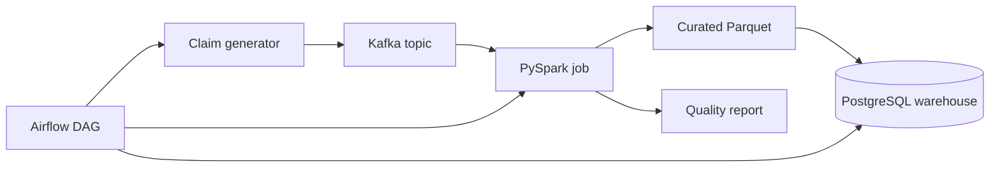

# Insurance Claims Data Platform

An end-to-end data engineering portfolio project that simulates how an insurance company ingests, validates, transforms, and models motor-claim events.

## What this project demonstrates

- Event-driven ingestion with Kafka-compatible JSON messages
- Distributed transformation with PySpark
- Workflow orchestration with Apache Airflow
- Dimensional modelling in PostgreSQL
- Data-quality checks for duplicate, invalid, and inconsistent claims
- Reproducible local infrastructure with Docker Compose
- Automated unit tests and GitHub Actions

> All records are synthetic. The repository contains no customer or company data.

## Architecture



## Repository structure

```text
airflow/dags/              Pipeline orchestration
data/sample/               Small synthetic input fixture
docker/                    Container configuration
src/claims_platform/       Reusable domain and quality logic
spark/                     Distributed transformation job
sql/                       Warehouse schema and analytics
tests/                     Unit tests
```

## Quick start

### Run the lightweight pipeline

Requires Python 3.11+ and no external service.

```bash
python -m src.claims_platform.pipeline \
  --input data/sample/claims.jsonl \
  --output build/curated_claims.jsonl \
  --quality-report build/quality_report.json
```

Run the tests:

```bash
python -m unittest discover -s tests -v
```

### Run the platform stack

```bash
docker compose up -d
```

Services:

| Service | Address | Purpose |
|---|---|---|
| Airflow | http://localhost:8080 | Pipeline orchestration |
| Kafka | localhost:9092 | Claim-event ingestion |
| PostgreSQL | localhost:5432 | Analytics warehouse |

Default local credentials are intentionally development-only and can be changed in `.env`.

## Data contract

Each claim event includes a unique claim identifier, anonymised policy and vehicle identifiers, event time, accident date, claim type, status, amounts, location, and source system. Validation rejects records when:

- required values are missing;
- dates are in an impossible order;
- amounts are negative or the paid amount exceeds the claim amount;
- categorical values are outside the contract;
- the same `claim_id` occurs more than once.

Invalid records are excluded from curated output and summarised by reason in the quality report.

## Warehouse model

The SQL model follows a star schema:

- `fact_claim`: claim measures and dimension keys
- `dim_policy`: anonymised policy identifiers
- `dim_vehicle`: vehicle attributes
- `dim_date`: reusable calendar attributes
- `dim_location`: city and region

Example business queries in `sql/analytics_queries.sql` calculate monthly loss ratio proxies, processing time, claim frequency, and suspicious duplicate activity.

## Engineering decisions

- Domain validation is implemented in plain Python so it can be tested without infrastructure.
- The Spark job reuses the same rules conceptually at scale and writes partitioned Parquet.
- The pipeline is idempotent: duplicate claim identifiers are quarantined instead of loaded twice.
- Personally identifiable information is intentionally absent; identifiers are synthetic hashes.
- Infrastructure and application code are separated to keep deployment choices replaceable.

## Possible extensions

- Schema Registry with Avro contracts
- Great Expectations or Soda checks
- dbt models and documentation
- S3/MinIO data lake layers
- Prometheus and Grafana observability
- Slowly changing policy and vehicle dimensions

## License

MIT
